<div align="center">

<a href="https://bikram-eight.vercel.app"></a>

<br>

<a href="https://bikram-eight.vercel.app"></a>


### The personal site of **Bikram Dey**, cybersecurity analyst & penetration tester.

A cyberpunk, Tokyo‑flavoured portfolio with a WebGL Sharingan, a VAPT request desk,<br>
a bug bounty Hall of Fame and a hardened, puzzle‑gated admin console. Every word on it lives in MongoDB.

**[▶ Open the live site](https://bikram-eight.vercel.app)** &nbsp;·&nbsp;
[Features](#features) &nbsp;·&nbsp;
[Tour](#tour) &nbsp;·&nbsp;
[Architecture](#architecture) &nbsp;·&nbsp;
[Security](#security-model) &nbsp;·&nbsp;
[Quick start](#quick-start) &nbsp;·&nbsp;
[Deploy](#deploy-on-vercel)

<br>

<a href="https://bikram-eight.vercel.app">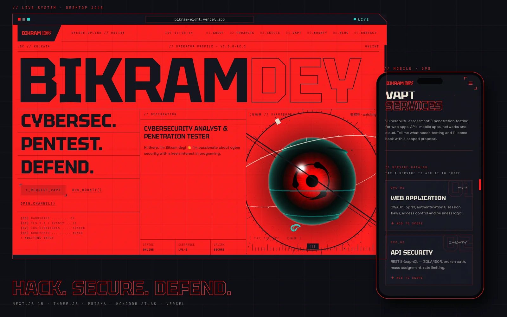</a>

<br><br>


</div>


<sub><code>// 01 · 機能</code></sub>

## Features

<table>
<tr>
<td width="33%" valign="top">

**👁 WebGL Sharingan**<br>
three.js with hand‑written GLSL. The eye follows your cursor, blinks, glitches, and turns into a Mangekyō when you tap it. Without WebGL you get an SVG fallback.

</td>
<td width="33%" valign="top">

**🛰 VAPT desk**<br>
Six service cards (web, API, mobile, network, cloud, code review) feed a scoped request form with timeline, budget, NDA and a required "I'm authorised" check. Each request gets a `VAPT-XXXXXX` reference.

</td>
<td width="33%" valign="top">

**🏆 Bug bounty Hall of Fame**<br>
Findings with severity, CVE, bounty and report link, plus totals, a severity bar and an "acknowledged by" marquee. Findings from **private programs are redacted on the server**, so the name and link never reach the browser.

</td>
</tr>
<tr>
<td valign="top">

**✉ Program invites**<br>
Security teams can invite Bikram to a private program, public program, VDP or live hacking event. Each invite gets a `BB-XXXXXX` reference.

</td>
<td valign="top">

**🐙 GitHub sync**<br>
One click pulls the avatar, location and every public repo. New repos show up by themselves (forks and archived repos are skipped), and a README excerpt stands in for a missing description. The site shows pinned repos plus the 5 latest, with a "show all" button.

</td>
<td valign="top">

**🔗 LinkedIn import**<br>
Drop the LinkedIn data‑export ZIP. It is unzipped in the browser and previewed first. Then import experience, education, certifications, projects and skills.

</td>
</tr>
<tr>
<td valign="top">

**🔐 Hardened admin console**<br>
Hidden behind a puzzle, with PIN login, lockouts, database sessions, origin checks and a login history. Details in [Security model](#security-model).

</td>
<td valign="top">

**📝 Markdown blog**<br>
Drafts and published posts at `/blog/<slug>`, with read time. Markdown becomes React elements, never raw HTML.

</td>
<td valign="top">

**⚡ Static and fresh**<br>
Pages are pre‑rendered and served from the edge. They re‑render at most once a minute, and immediately after any save in the admin console. Sections with no data yet hide themselves.

</td>
</tr>
</table>

On a first visit an **experience gate** asks for *Safe mode* or *Glitch mode*, like the photosensitivity warnings in games. Safe mode, and `prefers-reduced-motion`, calm the 3D scene and switch off flicker.


<sub><code>// 02 · 画面</code></sub>

## Tour

<table>
<tr>
<td width="50%">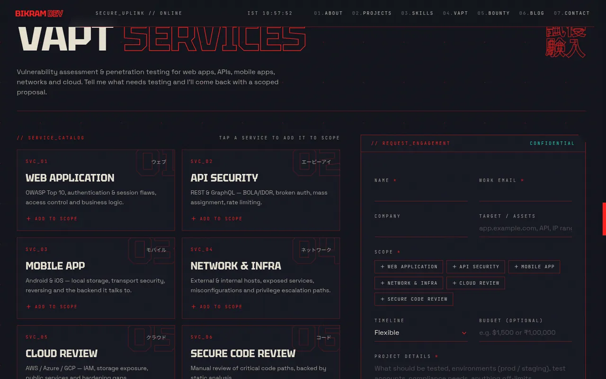<br><sub><b>VAPT desk</b>: tap a service and it joins the request scope</sub></td>
<td width="50%">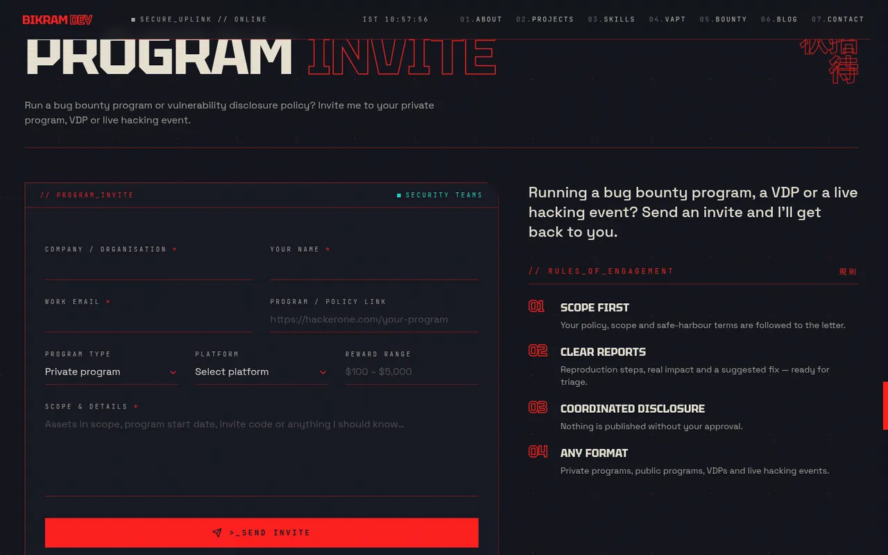<br><sub><b>Program invite</b>: for bug bounty programs, VDPs and live events</sub></td>
</tr>
<tr>
<td>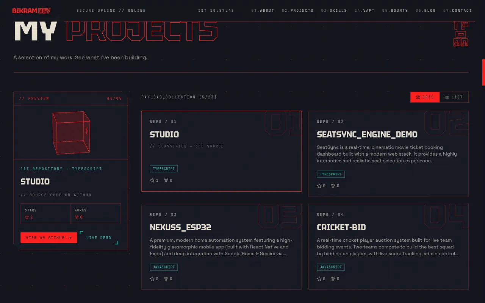<br><sub><b>Projects</b>: synced from GitHub, pinned + latest, show all</sub></td>
<td>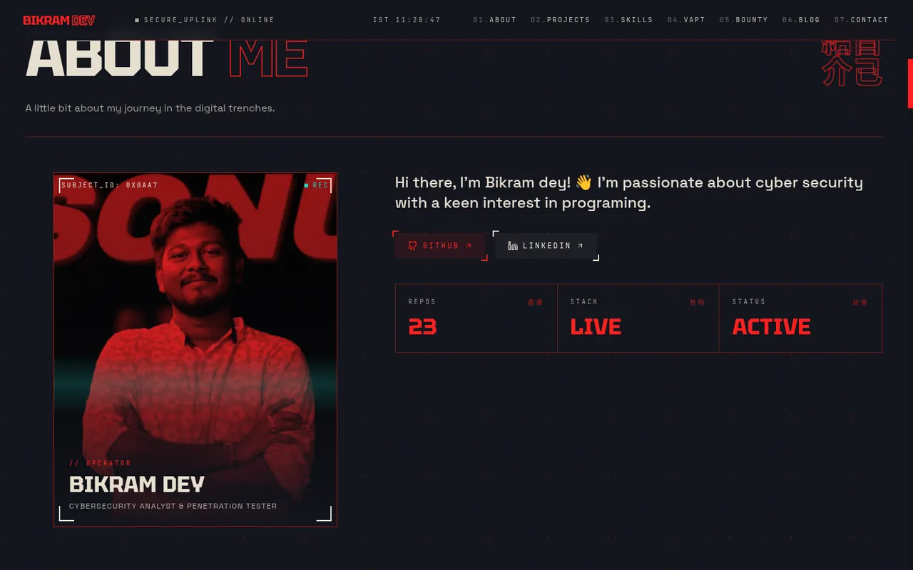<br><sub><b>Dossier</b>: profile, links and live stats</sub></td>
</tr>
</table>

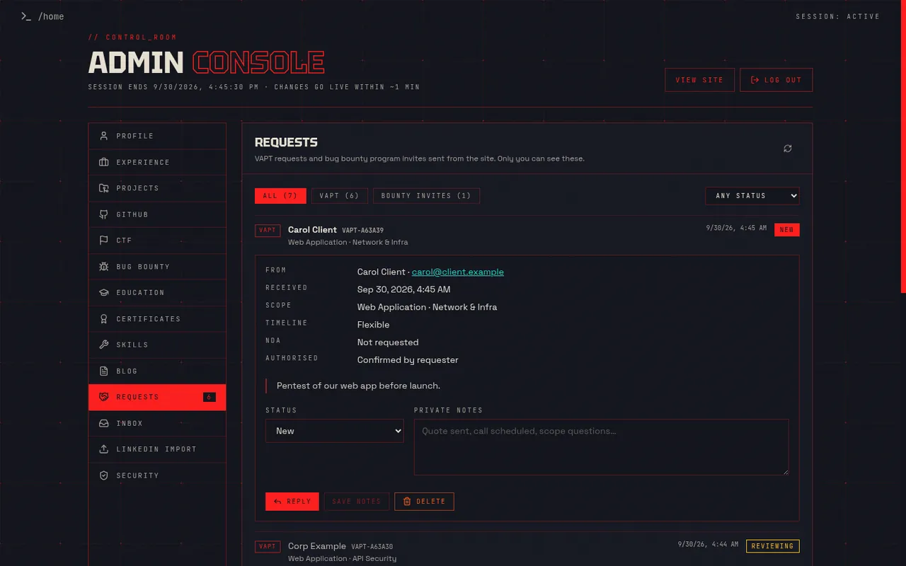
<p align="center"><sub><b>Admin console, Requests tab</b> (demo data): status pipeline, private notes, reply by email</sub></p>


<sub><code>// 03 · 構成</code></sub>

## Architecture

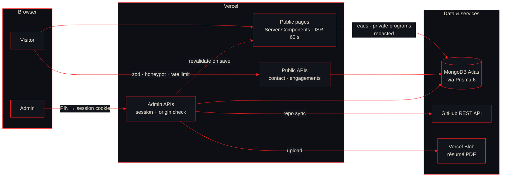

- **One data layer.** `src/lib/portfolio-data.ts` loads everything a page needs in parallel, redacts private bug bounty programs and hides empty sections. Public pages never call the API routes.
- **One CRUD factory.** `collectionHandlers()` in `src/lib/api.ts` gives every collection admin‑only writes, zod validation, clean 400/404/409 errors and instant revalidation.
- **Admin is a client app** in `src/components/admin/*` that talks to the same API routes.


<sub><code>// 04 · 防御</code></sub>

## Security model

A security portfolio should survive being poked at, so the controls are written down here.

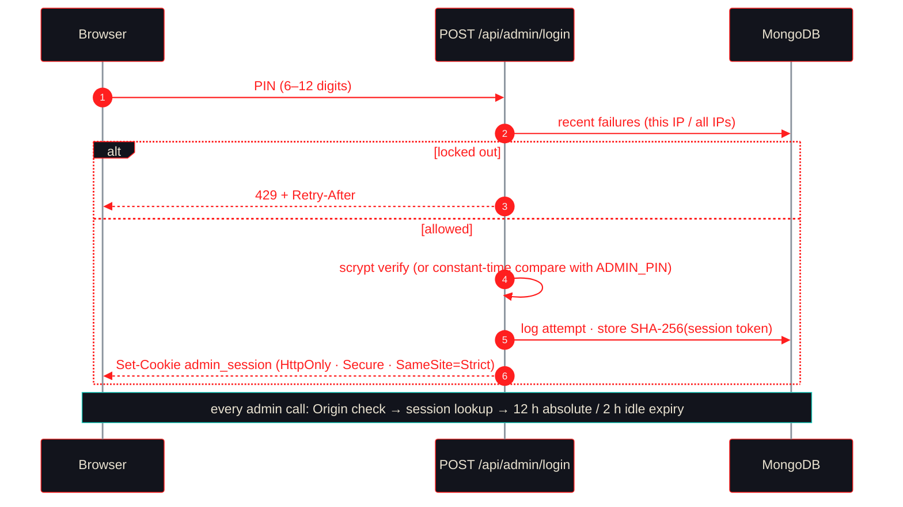

| Surface | Control |
|---|---|
| **Admin PIN** | 6–12 digits. A new PIN is rejected if it is weak (repeats, sequences, common PINs). It is stored as **scrypt** (N=16384, r=8, p=1, 16‑byte salt). The first‑login `ADMIN_PIN` is compared in constant time. |
| **Brute force** | 5 wrong PINs from one IP lock that IP for **15 min**. 40 failures across all IPs lock everyone for **5 min**. Every attempt is logged and kept for 30 days. |
| **Sessions** | 32 random bytes. Only the **SHA‑256 hash** is stored. The cookie is `HttpOnly`, `Secure` and `SameSite=Strict`. Sessions end after 12 h, or 2 h without activity. Other devices can be signed out from **Security**. |
| **CSRF** | A state‑changing admin request with a foreign `Origin` gets a `403`. |
| **Public forms** | zod validation, a honeypot (bots get a fake success) and hourly limits per IP and overall (4/40 for requests, 5/60 for contact). Submissions store only a truncated SHA‑256 of the sender's IP. |
| **Private programs** | Redacted on the server before rendering. The findings list API is admin‑only. |
| **Content** | Blog Markdown renders to React elements. No raw HTML is injected. |
| **Headers** | HSTS (2 years, preload), `X-Frame-Options: DENY`, `nosniff`, strict `Referrer-Policy`, a `Permissions-Policy` that turns off camera, mic and geolocation, and no `X-Powered-By`. |
| **Obscurity** | `/admin` is a decoy and the real console sits behind a puzzle. That's for fun only; none of the controls above depend on it. |

Found something? Please report it privately through the [contact form](https://bikram-eight.vercel.app/#contact) instead of opening a public issue.


<sub><code>// 05 · 技術</code></sub>

## Tech stack

| Layer | Tech |
|---|---|
| Framework | Next.js 15 (App Router, Server Components, ISR) · React 18 · TypeScript (strict) |
| 3D & motion | three.js with custom GLSL shaders · Motion (Framer Motion) |
| Styling | Tailwind CSS 3 · shadcn/ui on Radix primitives · lucide + react‑icons |
| Data | Prisma 6 · MongoDB Atlas · zod 4 |
| Files | Vercel Blob (résumé PDF) · fflate (LinkedIn ZIP, unzipped in the browser) |
| Quality | Jest 30 + Testing Library · ESLint · `tsc --noEmit` |
| Hosting | Vercel |

<sub><code>// 06 · 準備</code></sub>

## Quick start

You need **Node.js 18.18+** (20 or 22 recommended) and a **MongoDB Atlas** cluster. The free tier works. Prisma needs a replica set, and Atlas always runs one.

```bash
git clone https://github.com/modhack2003/studio.git
cd studio
npm install              # also runs prisma generate
cp .env.example .env     # set DATABASE_URL and ADMIN_PIN
npm run db:push          # create collections + indexes (safe, keeps data)
npm run prisma:seed      # optional sample data; skipped if a profile exists
npm run dev              # http://localhost:9002
```

The admin console, first login and day‑to‑day content workflow are covered in **[SETUP.md](SETUP.md)**.

### Environment

| Variable | Required | Purpose |
|---|---|---|
| `DATABASE_URL` | ✅ | Atlas URI **including the database name** (`…mongodb.net/portfolio?…`). URL‑encode special characters in the password. |
| `ADMIN_PIN` | ✅ first login | 6–12 digits. After you log in, set a new PIN in **Security**. It is stored hashed and this variable is then ignored. |
| `GITHUB_TOKEN` | – | Read‑only token that raises GitHub's rate limit for the sync. |
| `CRON_SECRET` | for scheduled sync | Random production secret authenticating the daily GitHub refresh. |
| `GITHUB_USERNAME` | – | Fallback when the profile has no GitHub URL (`modhack2003`). |
| `BLOB_READ_WRITE_TOKEN` | – | Only needed to upload a résumé PDF. Pasting a link works too. |

### Scripts

| Command | Does |
|---|---|
| `npm run dev` | Dev server with Turbopack on port 9002 |
| `npm run build` / `npm start` | Production build / serve |
| `npm run lint` · `npm run typecheck` · `npm test` | ESLint · `tsc` · Jest |
| `npm run db:push` | Sync collections and indexes with `prisma/schema.prisma` |
| `npm run prisma:seed` | Sample data (refuses to overwrite an existing profile unless `SEED_FORCE=true`) |
| `npm run github:sync` | Command‑line version of **GitHub → Sync now** |

<sub><code>// 07 · 展開</code></sub>

## Deploy on Vercel

1. Import the repo in Vercel. The Next.js preset is picked up automatically.
2. Add the variables above under **Settings → Environment Variables**.
3. Deploy. `postinstall` generates the Prisma client during the build.
4. Once, from your machine, run `DATABASE_URL="<production uri>" npm run db:push` to create the collections and indexes.
5. Log in, set a new PIN in **Security**, then press **GitHub → Sync now**.

> [!TIP]
> Seeing `Server selection timeout` or `bad auth`? In Atlas, open **Network Access** to Vercel (for example `0.0.0.0/0`), and check that the database name is part of `DATABASE_URL`.


<sub><code>// 08 · 管理</code></sub>

## Admin console

| Tab | What it does |
|---|---|
| **Profile** | Name, title, bio, avatar, social links, résumé (PDF upload or link) and bug bounty profile links |
| **Experience · Projects · CTF · Education · Certificates · Skills** | Add, edit and delete. The site updates right after you save. |
| **GitHub** | Sync now, then show/hide, pin or rename any repo |
| **Bug bounty** | Findings with severity, platform, bounty and currency, CVE, report link, and hall‑of‑fame / private‑program flags |
| **Blog** | Markdown posts, drafts, publish |
| **Requests** | VAPT requests and program invites: new → reviewing → accepted → completed / declined, private notes, reply by email |
| **Inbox** | Contact‑form messages |
| **LinkedIn import** | Drop the data‑export ZIP, preview, import |
| **Security** | Change the PIN, see active sessions, sign out other devices, view the login history |

<details>
<summary><b>API reference</b></summary>

<br>

| Route | Methods | Access |
|---|---|---|
| `/api/projects` · `/api/certificates` · `/api/education` · `/api/experience` · `/api/ctf` | `GET` · `POST` | GET public, POST admin |
| `…/[id]` for the collections above, plus `/api/blog/[id]` and `/api/bounties/[id]` | `PUT` · `DELETE` | admin |
| `/api/blog` · `/api/bounties` | `GET` · `POST` | admin (drafts and private programs stay private) |
| `/api/personal-data` · `/api/skills` | `GET` · `PUT` | GET public, PUT admin |
| `/api/contact` | `POST` | public, rate‑limited + honeypot |
| `/api/engagements` | `POST` · `GET` | POST public (rate‑limited + honeypot), GET admin |
| `/api/engagements/[id]` · `/api/messages/[id]` | `PATCH` · `DELETE` | admin |
| `/api/messages` | `GET` | admin |
| `/api/github/repos` · `/api/github/repos/[id]` · `/api/github/sync` | `GET` · `PUT` · `DELETE` · `POST` | admin |
| `/api/import/linkedin` · `/api/resume/upload` | `POST` | admin |
| `/api/admin/login` · `/api/admin/logout` · `/api/admin/session` | `POST` · `POST` · `GET` | public |
| `/api/admin/security` · `/api/admin/security/pin` · `/api/admin/sessions` | `GET` · `POST` · `DELETE` | admin |
| `/api/ctf/verify` | `POST` | public, rate‑limited (puzzle check) |

</details>

<details>
<summary><b>Project structure</b></summary>

<br>

```text
.
├── prisma/
│   ├── schema.prisma          # 15 models: content, bounty findings, requests, sessions, login log
│   └── seed.ts                # sample data; refuses to touch a database that already has a profile
├── scripts/sync-github.ts     # npm run github:sync
├── src/
│   ├── app/
│   │   ├── page.tsx           # the one-page site (ISR, revalidate 60 s)
│   │   ├── blog/              # /blog and /blog/[slug]
│   │   └── api/               # route handlers (public + admin)
│   ├── components/
│   │   ├── cyber/             # Sharingan (three.js), cursor, experience gate, form kit, primitives
│   │   ├── sections/          # hero, about, experience, projects, ctf, skills, vapt, bounty, invite, blog, contact
│   │   ├── admin/             # dashboard, collection editor, requests, inbox, GitHub, import, security
│   │   └── ui/                # shadcn/ui building blocks
│   └── lib/                   # data layer, auth, zod validators, GitHub + LinkedIn import, markdown
└── .github/assets/            # README art: generated SVGs + screenshots
```

</details>


<sub><code>// 09 · 設計</code></sub>

## Design system

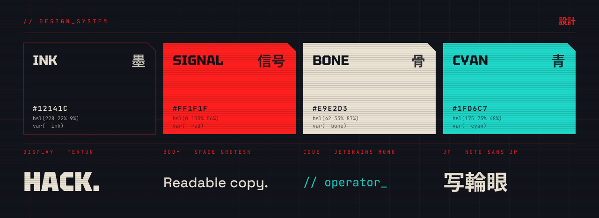

- **Ink, signal red, bone and cyan**, defined once as HSL variables in `globals.css` and used everywhere, including the shaders.
- **Tektur** for display, **Space Grotesk** for body text, **JetBrains Mono** for labels and **Noto Sans JP** for the Japanese section marks (経歴, 作品, 賞金稼ぎ…).
- Recurring details: hairline grids, bracket corners, cut‑corner cards, outlined headline words, marquees, scanlines, grain and a custom cursor.
- Motion respects the experience gate and `prefers-reduced-motion`. The README art here does too.

<sub>The banner, terminal, divider, palette and footer above are hand-generated SVGs. The brand fonts are converted to vector paths so they render the same everywhere, animate with pure CSS, and sit still for reduced motion.</sub>

## Credits

- Visual language inspired by @bikramdey2003.
- The Sharingan is a fan tribute to *Naruto* by Masashi Kishimoto.
- Fonts from Google Fonts (SIL Open Font License).

<br>

<div align="center">

<a href="https://bikram-eight.vercel.app"></a>

**[Live site](https://bikram-eight.vercel.app)** &nbsp;·&nbsp; **[LinkedIn](https://www.linkedin.com/in/bikram-dey-700452997020031312/)** &nbsp;·&nbsp; **[GitHub](https://github.com/modhack2003)** &nbsp;·&nbsp; **[Hire me for VAPT](https://bikram-eight.vercel.app/#vapt)**

</div>
